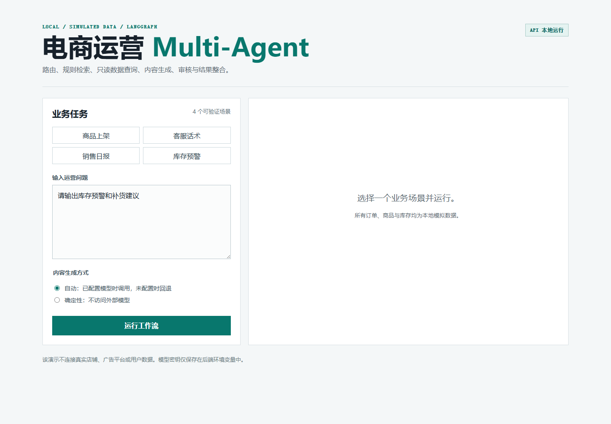

# 电商运营 Multi-Agent 平台原型

基于 Nanobot、LangGraph、FastAPI 与 React 的本地可运行项目。它将商品上架、客服话术、销售日报和库存预警拆解为 Router、Knowledge、Data、Content、Review、Finalizer 六个可追踪节点。

> 重要边界：商品、订单、库存和规则均为本地示例数据。本项目不接入 Shopify、广告平台、ERP/WMS、真实店铺或真实用户数据。

## 能力与架构

- LangGraph 编排角色状态流转；路由、检索、只读数据查询和审核保持确定性，便于测试。
- 可选 OpenAI-compatible 模型仅参与 Content 节点的文案改写；未配置密钥时自动回退到确定性结果。
- FastAPI 返回结果、角色轨迹、来源、审核状态与执行模式；React 页面用于输入任务和查看全过程。
- SQLite 连接采用只读 URI 和 Authorizer；Review 节点拦截无证据、空输出和夸大承诺。

详见 [架构说明](docs/architecture.md) 与 [四个演示场景](docs/demo-scenarios.md)。

## 本地启动

需要 Python 3.12、Node.js 22 和 Docker Desktop（容器方式）。在本目录执行：

```powershell
python -m venv .venv
.\.venv\Scripts\Activate.ps1
pip install -r requirements.txt
python -m unittest discover -s tests -v
uvicorn api.main:app --reload --port 8000
```

另开一个 PowerShell：

```powershell
Set-Location .\webapp
npm ci
npm run dev
```

浏览器打开 `http://localhost:5173`。前端默认请求 `http://localhost:8000`，模型密钥只保存在后端 `.env`。



## Docker Compose

```powershell
docker compose up --build
```

浏览器打开 `http://localhost:5173`；API 健康检查为 `http://localhost:8000/api/health`。停止服务使用 `docker compose down`。

## 可选模型配置

如需启用模型，先执行 `Copy-Item .env.example .env`，再在 `.env` 填入 OpenAI-compatible 服务商提供的值：

```text
OPENAI_API_KEY=你的密钥
OPENAI_BASE_URL=https://服务商地址/v1
OPENAI_MODEL=模型名称
```

页面选择“自动”时才会尝试调用模型。配置缺失或调用失败时，界面会显示确定性回退原因，不会暴露密钥。

## Nanobot WebUI Skill

| Skill | 用途 |
| --- | --- |
| `ecommerce-operations` | 以可验证工作流处理四类电商运营请求。 |
| `jd-match` | 基于项目事实提取岗位匹配与待补强项。 |
| `boss-reply` | 生成 BOSS 投递、HR 追问和面试开场文本。 |
| `interview-drill` | 围绕 RAG、受控 SQL、FastAPI、Docker 和部署边界生成面试题。 |

先在 PowerShell 进入本目录并执行：

```powershell
powershell -NoProfile -ExecutionPolicy Bypass -File .\install_to_nanobot_workspace.ps1
```

该脚本将核心工作流复制到 `~/.nanobot/workspace/ecommerce_multi_agent/`，并将 Skill 复制到 `~/.nanobot/workspace/skills/ecommerce-operations/`。若该 Python 环境未安装 LangGraph，Skill 会执行同一组确定性节点，仍可运行四类演示。

随后：

1. 启动 Nanobot WebUI，保持默认权限。
2. 输入 `使用 $ecommerce-operations，请输出库存预警和补货建议`。
3. Skill 在工作区内执行 `python -m ecommerce_multi_agent.run_demo --scenario <场景>`，并返回含证据与边界的审核结果。

## 验证与录屏

```powershell
python -m unittest discover -s tests -v
python -m ecommerce_multi_agent.run_demo --scenario inventory_alert
```

测试覆盖四个支持场景、不支持请求拦截、API 响应以及无模型配置时的确定性回退。演示录制顺序见 [录屏脚本](docs/recording-script.md)。

## 事实边界

- 模拟数据中的成交额、库存与客服规则不能写成真实业务结果。
- API Key 仅保存于本机 `.env`，不提交至仓库，也不发送给前端。
- 不声明 MCP、Dify、n8n、K8s、微调或生产部署能力。
