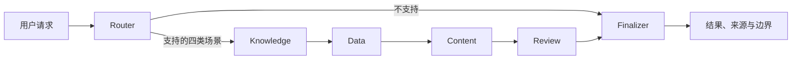

# 架构与边界

工作流由 LangGraph 编排六个节点：Router、Knowledge、Data、Content、Review、Finalizer。当前的路由、检索、SQLite 查询和审核均是可测试的确定性逻辑；可选的 OpenAI-compatible 模型只参与 Content 节点的文本改写。

## 数据与安全边界

- 商品、订单、库存均为本地 SQLite 模拟数据；运营规则来自项目内的示例 Markdown 文件。
- Data 节点使用 SQLite 只读 URI 和 Authorizer，只允许读取与函数调用。
- Review 节点会阻断无路由、空输出、缺少证据及未经证实的营销/功效承诺。
- API Key 仅从后端环境变量读取，浏览器和 Git 仓库均不保存密钥。
- 项目不连接 Shopify、广告平台、ERP/WMS、真实店铺或真实用户数据。
