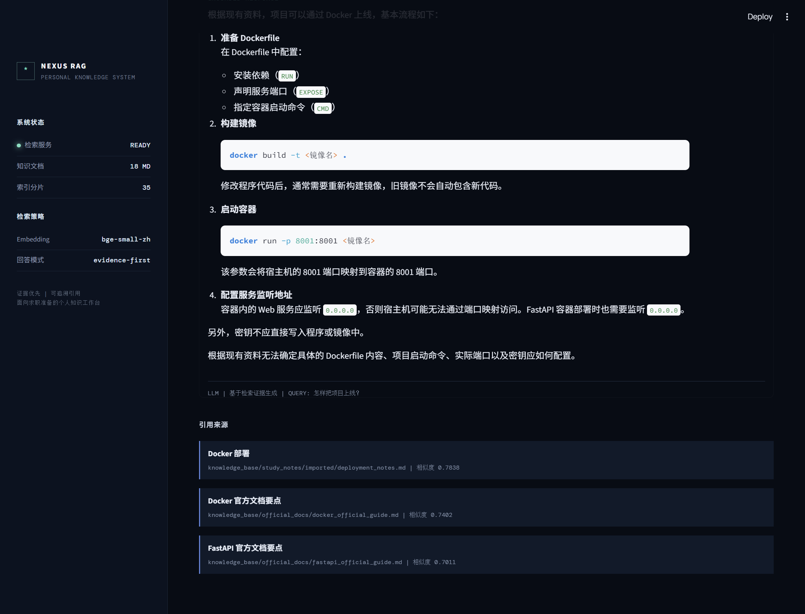
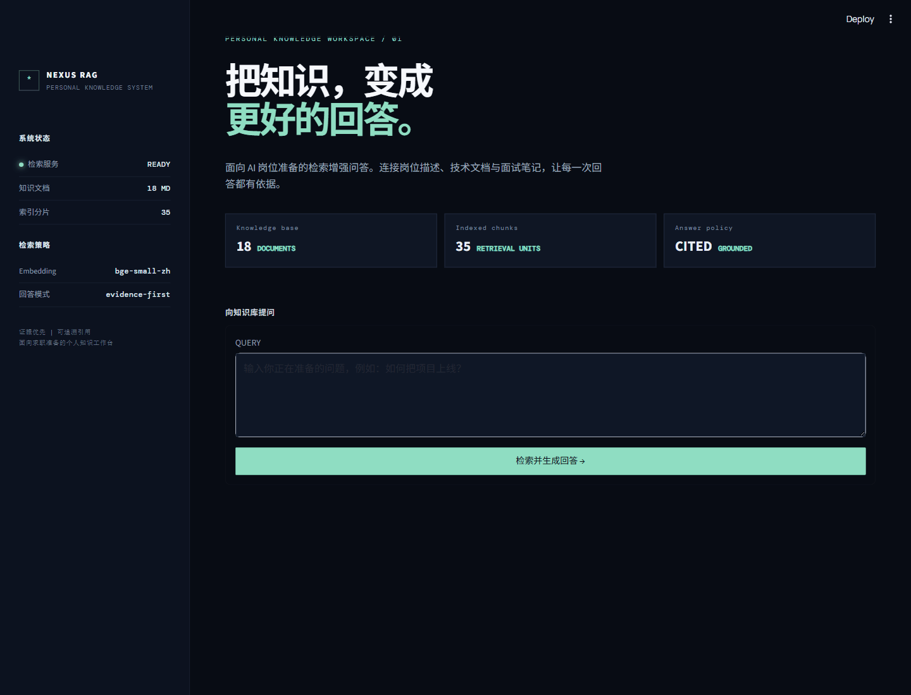

# RAG 求职知识库助手

这是一个用于学习和展示 RAG、Embedding、来源引用和 FastAPI 的本地知识库问答项目。

项目默认使用本地中文 Embedding 模型完成文档检索；配置 OpenAI-compatible 接口后，
会基于检索证据生成回答。未配置模型或外部调用失败时，自动回退为抽取式回答，保证离线演示可用。

## 项目演示

模型生成方式与来源引用：



操作演示：输入问题后，页面展示模型生成回答和检索来源。



完整的 3 分钟录制讲解与操作顺序见 [RAG录制讲解稿.md](RAG录制讲解稿.md)。

- [GitHub 项目目录](https://github.com/flghting1/llm-practice/tree/master/rag_practice)
- [播放或下载完整旁白演示（MP4，14.7 MB）](https://github.com/flghting1/llm-practice/raw/refs/heads/master/rag_practice/assets/rag-demo-narrated.mp4)
- [查看模型生成与来源引用截图](https://github.com/flghting1/llm-practice/blob/master/rag_practice/assets/rag-llm-sources.png)

离线模式下，真实接口调用 `POST /ask` 的响应如下。`answer_mode` 会明确标识回答来自模型生成还是离线证据回退，避免把演示模式误表述为真实模型调用。

```json
{
  "answer": "项目上线可以使用 Docker 部署。Docker 将应用和运行依赖封装成容器，再运行于服务器。",
  "answer_mode": "extractive_fallback",
  "sources": [
    {
      "title": "Docker 部署",
      "source": "knowledge_base/study_notes/imported/deployment_notes.md",
      "score": 0.7838
    }
  ]
}
```

## 已实现功能

- JSON 文档加载
- 关键词检索
- TF-IDF 向量检索
- 中文 Embedding 语义检索
- TopK 相似度排序
- 查询改写
- 低相似度拒答
- Prompt 拼接
- 来源文件与相似度展示
- `GET /health` 健康检查
- `POST /ask` 知识库问答接口
- 可选 OpenAI-compatible 生成层与离线回退
- 空输入与无答案处理
- 固定测试集批量评测

## RAG 流程

```text
用户问题
→ 查询改写
→ 生成问题 Embedding
→ 计算问题与文档的相似度
→ 返回 Top 3 文档
→ 使用 0.60 阈值过滤
→ 拼接 Prompt
→ 调用可选 LLM 生成回答（失败时抽取式回退）
→ 返回答案和引用来源
```

## Markdown 知识库

知识库文档放在 `knowledge_base/` 目录下，按用途分为：

- `job_descriptions/`：岗位 JD
- `official_docs/`：官方文档
- `interview_notes/`：面试题和回答
- `study_notes/`：学习笔记

程序会递归读取目录中的 Markdown 文件，提取一级标题作为文档标题，并按 300 字符切分，片段之间保留 50 字符重叠。

查看当前知识库统计：

```powershell
.venv\Scripts\python.exe inspect_knowledge_base.py
```

将旧 JSON 资料转换为 Markdown：

```powershell
.venv\Scripts\python.exe migrate_json_to_markdown.py
```

当前知识库包含 18 份 Markdown 文档，切分后得到 35 个片段。

## 环境要求

- Python 3.12
- Windows PowerShell
- 首次运行需要下载 `BAAI/bge-small-zh-v1.5` 模型

## 安装依赖

```powershell
python -m venv .venv
.venv\Scripts\Activate.ps1
python -m pip install -r requirements.txt
```

如果无法连接 Hugging Face，可以在当前 PowerShell 临时使用镜像：

```powershell
$env:HF_ENDPOINT = "https://hf-mirror.com"
$env:HF_HUB_DOWNLOAD_TIMEOUT = "120"
```

## 启动 API

```powershell
python -m uvicorn rag_api:app --host 127.0.0.1 --port 8001
```

Swagger 地址：

```text
http://127.0.0.1:8001/docs
```

## 使用 Docker 运行 API

构建 Docker 镜像：

```powershell
docker build -t rag-practice-api .
```

启动容器并映射端口：

```powershell
docker run --rm -p 8001:8001 rag-practice-api
```

启动后访问：

```text
健康检查：http://127.0.0.1:8001/health
接口文档：http://127.0.0.1:8001/docs
```

首次启动时可能需要下载 Embedding 模型，因此等待时间会稍长。终端显示 `Uvicorn running on http://0.0.0.0:8001` 表示启动成功。

按 `Ctrl + C` 可以停止并删除当前容器。

## 启动网页前端

本项目采用前后端分离方式运行，需要同时启动两个终端。

终端 1 启动 FastAPI：

```powershell
python -m uvicorn rag_api:app --host 127.0.0.1 --port 8001
```

终端 2 启动 Streamlit：

```powershell
python -m streamlit run streamlit_app.py --server.port 8501
```

网页地址：

```text
http://localhost:8501
```

前后端数据流：

```text
浏览器
→ Streamlit 网页
→ POST /ask
→ FastAPI
→ Embedding 检索
→ 返回答案和来源
→ 网页展示
```

可以通过环境变量修改后端地址：

```powershell
$env:RAG_API_URL = "http://127.0.0.1:8001/ask"
```

## 接口说明

### 健康检查

```http
GET /health
```

成功响应：

```json
{
  "ok": true
}
```

### 知识库问答

```http
POST /ask
```

请求示例：

```json
{
  "question": "怎样把项目上线？"
}
```

响应示例：

```json
{
  "answer": "项目上线可以使用 Docker 部署。",
  "answer_mode": "extractive_fallback",
  "sources": [
    {
      "title": "Docker 部署",
      "source": "deployment_notes.md",
      "score": 0.7819
    }
  ]
}
```

配置真实模型回答（服务端环境变量，不要提交密钥）：

```powershell
$env:RAG_LLM_BASE_URL = "https://your-openai-compatible-endpoint/v1"
$env:RAG_LLM_API_KEY = "your-key"
$env:RAG_LLM_MODEL = "your-model"
```

也可以复制 `.env.example` 的变量名到部署平台或本地终端。`.env` 已被 Git 忽略，密钥不应写入 README、截图或代码。

`answer_mode` 为 `llm` 表示使用模型生成，`extractive_fallback` 表示使用离线回退，`no_answer` 表示检索证据不足时拒答。接口同时返回非敏感的 `generation_status`，用于区分未配置、网络、HTTP 和响应格式问题，避免模型调用失败被误判为成功。

### 不落盘配置并启动真实模型演示

项目提供 `start_with_llm.py`，运行时会隐藏输入 API Key，只将它传给当前 Uvicorn 子进程，服务退出后自动消失，不创建 `.env` 文件。PowerShell 用户也可以使用同目录的 `start_with_llm.ps1` 转发器。

```powershell
& ".\.venv\Scripts\python.exe" ".\start_with_llm.py" --base-url "https://your-openai-compatible-endpoint/v1" --model "your-model-name" --port 8013
```

启动后检查：

```powershell
Invoke-RestMethod http://127.0.0.1:8001/health
```

当响应中的 `generation_configured` 为 `true` 时，再发送一个已有依据的问题。响应的 `answer_mode` 为 `llm`，才表示本次演示实际调用了模型服务。

## 输入与错误处理

- 空字符串不符合 Pydantic 规则，返回 `422`
- 只有空格的输入返回 `400`
- 知识库没有答案时返回 `200`，同时 `sources` 为空
- 无依据时回答：`根据现有资料无法确定。`

## 运行自动评测

运行旧版 JSON 知识库评测：

```powershell
.venv\Scripts\python.exe evaluate_embedding.py
```

运行 Markdown 知识库评测：

```powershell
$env:HF_HUB_OFFLINE = "1"
$env:TRANSFORMERS_OFFLINE = "1"
.venv\Scripts\python.exe evaluate_markdown.py
```

评测指标包括：

- Top 1 准确率
- Top 3 召回率
- 平均响应时间
- 来源引用完整率

运行答案依据检查：

```powershell
$env:HF_HUB_OFFLINE = "1"
$env:TRANSFORMERS_OFFLINE = "1"
.venv\Scripts\python.exe evaluate_answer_evidence.py
```

该检查判断回答是否非空、是否包含来源，以及回答内容是否能在引用片段中找到，作为当前阶段的可解释 Faithfulness 基线。

评测结果会追加到 JSONL 日志。运行日志已通过 `.gitignore` 排除，不提交到 Git。

## 当前评测结果

当前知识库包含 18 份 Markdown 文档，切分后得到 35 个片段。

- 测试问题数量：6
- Top 1 准确率：67%
- Top 3 召回率：100%
- 来源引用完整率：100%
- 基于规则的答案依据通过率：100%
- 文档向量缓存优化前平均响应时间：674.01 ms
- 文档向量缓存优化后平均响应时间：252.66 ms
- 缓存生效后单题响应时间约为 14～17 ms

## 真实模型端到端验收

在 2026-08-25 使用已配置的 OpenAI-compatible 服务完成一次真实调用验收，未记录或提交服务地址和密钥。

- `/health` 返回 `generation_configured: true`
- “怎样把项目上线？”返回 `answer_mode: llm` 和 `generation_status: success`
- 返回 3 条相关来源：Docker 部署、Docker 官方文档要点、FastAPI 官方文档要点
- 回答包含 Docker/容器/部署相关内容

无依据问题会返回 `answer_mode: no_answer`、空来源和固定拒答文案。该结果仅证明本次真实接口链路可用；不把单条问答结果当作生成质量指标。

## 失败案例复盘

固定评测中有两个问题的正确来源排在 Top 2：

- RAG 完整流程：简短学习笔记与完整基础文档发生排序竞争。
- FastAPI 自动接口文档：学习笔记与官方文档都包含 Swagger 相关内容。

正确来源均进入 Top 3，说明系统具备稳定召回能力，但相近文档之间的 Top 1 排序仍有优化空间。

答案依据检查最初为 67%。复核后发现同一 Markdown 文件的多个片段在评测脚本中被错误覆盖。修复为“一个来源对应多个片段”后，通过率恢复为 100%。

## 性能优化

原始实现会在每次提问时重新计算全部文档 Embedding。随着知识库从 11 份扩充至 18 份，平均响应时间上升到 674.01 ms。

项目随后加入进程内文档向量缓存：

- 第一次查询完成模型和文档向量初始化。
- 后续查询直接复用文档向量。
- 平均响应时间下降至 252.66 ms。
- 检索准确率和来源引用完整率保持不变。

## Docker 与前端验收

项目已经完成以下测试：

- Docker 镜像构建
- 容器 `/health` 健康检查
- 容器 `/ask` 知识库问答
- Markdown 来源路径返回
- Streamlit 有答案展示
- Streamlit 无答案拒答
- 容器停止和清理

## 当前限制

- 默认不配置真实 LLM，离线模式使用第一条检索片段作为可解释回退回答。
- 真实 LLM 生成质量取决于所配置的模型和服务端，不把小规模固定评测结果视为生产指标。
- 文档向量缓存只在当前进程内有效，服务重启后需要重新生成。
- 查询改写规则由人工维护。
- 当前固定评测集只有 6 个问题。
- 网页只支持单轮问答。
- 尚未部署到公网服务器。

## 后续可扩展方向

- 将知识库扩充到 30～50 份文档。
- 将固定评测集扩充到至少 20 个问题。
- 使用已配置的真实模型完成端到端回答质量与 Faithfulness 评测。
- 增加上传文档和用户反馈功能。
- 部署到公网服务器。
- 增加演示截图和演示视频。
