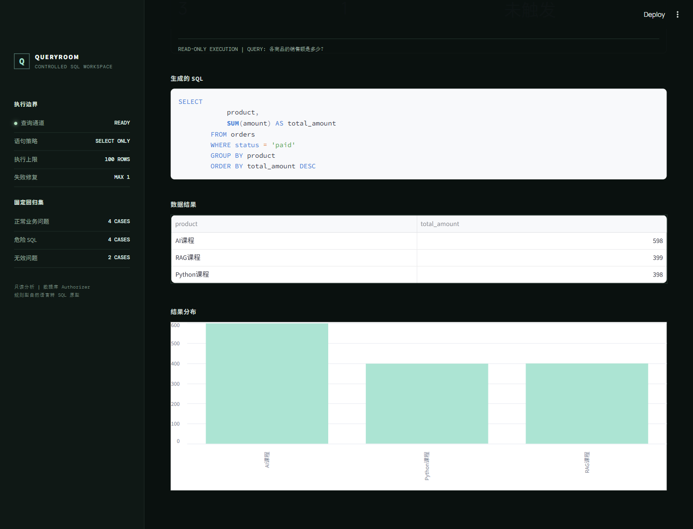
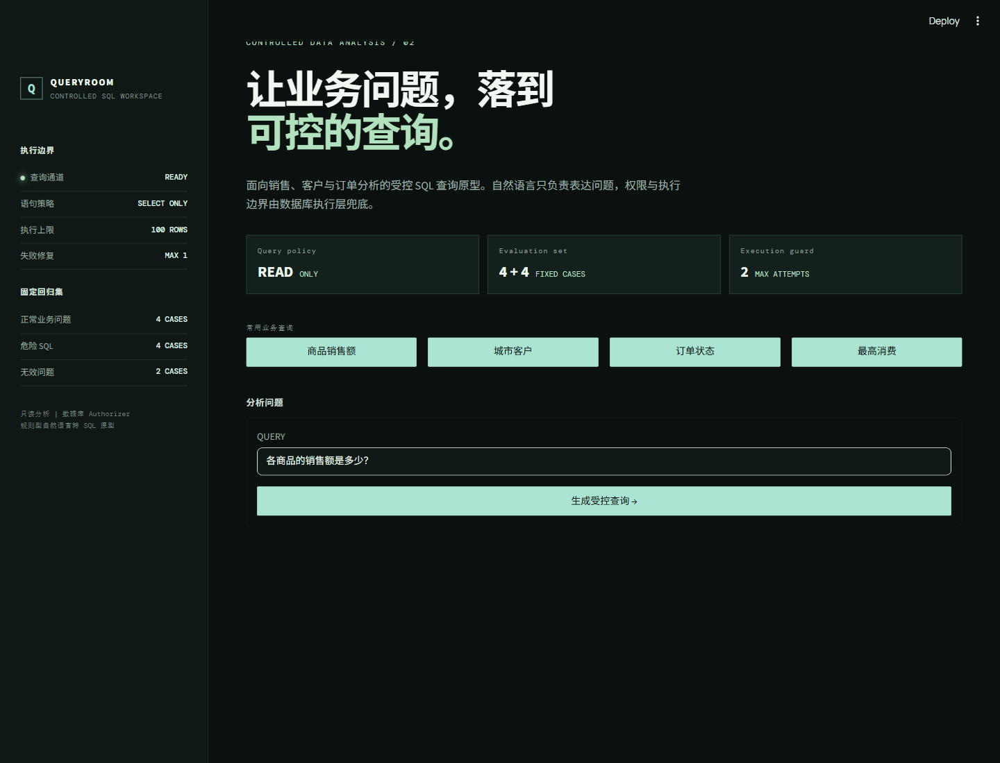

# SQL 数据分析 Agent

面向销售、客户和订单分析场景的受控 SQL 查询应用。用户输入自然语言问题后，系统生成可解释 SQL，通过安全执行层查询 SQLite，并在 FastAPI 与 Streamlit 中展示 SQL、结果解释、表格和图表。

当前版本采用**可解释规则**完成自然语言到 SQL 的转换，重点验证 SQL Agent 的完整链路、安全控制、失败处理、评测与部署能力；并未将规则原型表述为真实大模型自主生成。

## 项目演示

首页展示查询边界、固定回归集和四类业务问题：


真实查询结果会保留生成 SQL、返回记录和图表，方便核对查询依据：





完整的项目展示与录制顺序见 [SQL录制讲解稿.md](SQL录制讲解稿.md)，面试中的 60 秒讲解与追问见 [INTERVIEW_GUIDE.md](INTERVIEW_GUIDE.md)。

- [GitHub 项目目录](https://github.com/flghting1/llm-practice/tree/master/sql_agent_practice)
- [播放或下载完整旁白演示（MP4，3.5 MB）](https://github.com/flghting1/llm-practice/raw/refs/heads/master/sql_agent_practice/assets/sql-demo-narrated.mp4)
- [查看查询结果与 SQL 证据截图](https://github.com/flghting1/llm-practice/blob/master/sql_agent_practice/assets/sql-query-evidence.png)

## 项目解决的问题

业务人员需要查询销售额、客户分布和订单状态时，通常需要理解表结构和 SQL。项目将高频查询封装为自然语言入口，但数据库访问仍保持最小权限和可追溯性，避免“为了能查数据而放开模型权限”。

## 系统架构

```text
用户问题
  -> Streamlit 前端
  -> FastAPI /ask
  -> 规则型 SQL 生成与单次修复
  -> SQL 安全执行层
      -> 单条 SELECT
      -> 危险操作拦截
      -> 表字段白名单
      -> 最多 100 行结果
  -> SQLite 示例数据库
```

## 已实现能力

- 支持商品销售额、城市客户数、订单状态数量、最高消费客户四类业务问题
- 返回生成 SQL、查询说明、执行次数、表格和柱状图
- 仅允许单条 `SELECT`，拦截 `INSERT`、`UPDATE`、`DELETE`、`DROP` 等危险操作
- 使用 SQLite Authorizer 限制可访问的表与字段，拦截系统表和未授权字段
- SQL 失败后最多执行一次确定性修复，避免无限重试
- FastAPI `/health`、`/ask`，Streamlit 前端、Docker 健康检查和 JSONL 评测日志

## 实际评测范围与结果

固定评测包含 4 个正常业务问题、4 条危险 SQL、空问题、未知问题和一次失败 SQL 识别。

| 指标 | 结果 | 说明 |
| --- | ---: | --- |
| SQL 执行成功率 | 100% | 固定 4 条正常业务问题 |
| 危险 SQL 拦截率 | 100% | 固定 4 条危险语句 |
| 结果解释可用率 | 100% | 固定正常业务问题 |
| 无效问题拒绝率 | 100% | 空问题与未知问题 |
| 本地平均响应时间 | 约 1ms | 小型 SQLite 示例数据，不代表生产性能 |

测试集规模有限，以上结果仅代表当前固定场景，不等同于真实业务数据库的泛化能力或生产指标。

## 本地运行

```powershell
cd C:\Users\flghting\Documents\ChatGPT\AI职业\llm_practice\sql_agent_practice
.venv\Scripts\python.exe create_database.py
.venv\Scripts\python.exe -m uvicorn sql_api:app --host 127.0.0.1 --port 8003
```

另开终端启动前端：

```powershell
.venv\Scripts\python.exe -m streamlit run streamlit_app.py --server.port 8502
```

- Streamlit：`http://localhost:8502`
- Swagger：`http://127.0.0.1:8003/docs`
- 健康检查：`http://127.0.0.1:8003/health`

## 验证命令

```powershell
.venv\Scripts\python.exe test_sql_tool.py
.venv\Scripts\python.exe test_sql_agent_safety.py
.venv\Scripts\python.exe test_sql_permissions.py
.venv\Scripts\python.exe test_sql_repair.py
.venv\Scripts\python.exe evaluate_sql_agent_metrics.py
```

## Docker

```powershell
docker build -t sql-agent-api .
docker run --rm -d --name sql-agent-api -p 8004:8003 sql-agent-api
Invoke-RestMethod http://127.0.0.1:8004/health
docker stop sql-agent-api
```

## 当前限制

- 自然语言转 SQL 为规则实现，只覆盖预设的四类业务问题
- 使用本地 SQLite 示例数据库，未包含认证、多租户和行级权限
- SQL 修复只覆盖预设字段名错误，未接入大模型或 SQL AST 解析

## 面试材料

项目的 60 秒讲解、关键技术决策、常见追问和真实限制说明见 [INTERVIEW_GUIDE.md](INTERVIEW_GUIDE.md)。
